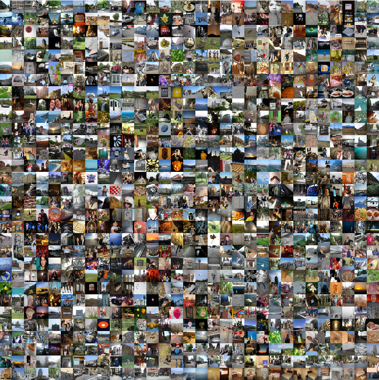

### An HVS-Oriented Saliency Map Prediction Model

<center>
<br/>
</center>

#The biological possible multi-layer saliency prediction model

##Digitial Brain Visual Computing Version 2.0(Complex and Alpha Version)

Human visual Cortex inspired multi-layer LNL model. In this model, the main components are:

<p>Nature Image --> VonKries Adaptation --> ATD  (Color opponent channel)
Wavelets Transform --> Wavelets Energy Map --> Contrast sensivity function (CSF) --> Saliency Prediction</p>

<p>This model derivated two version script： Matlab, Python. In the future, I
want to implemented all of these code on C++ or Java. If our goal is 
simulate of primate brain, we need to implement all everything to High 
performance Computer (HPC) with big framework architecture(C/C++/Java).
</p>
 

#### Python Alpha Version

I. Datasets:<br/>

Images: *The images can be download via bash scripts.*<br/>
Videos: *https://www.crcv.ucf.edu/data/UCF_Sports_Action.php.*<br/>


II. Scripts:<br/>

1. How to execute it<br/>

@caution: The code only can execute under conda envionment or virtual environment, otherwise,
it will cause errors. Pytorch only works under the virtual environment.<br/>

option 1: <br/>

*source ~/.bashrc *: (base) this conda environment.<br/>
*conda deactivate *: quit conda environment. <br/>


option 2:<br/>

cd virutal environment. <br/>
*python3 -m venv pytorch-BioMulti-L-NL* <br/>  
*source pytorch-BioMulti-L-NL/bin/activate* <br/>
*deactivate* <br/>

Run *InstallDepedendent.sh* to download and install dependent toolboxes.<br/>
Run* main.sh* to execute main funtion.<br/>

#### Python Beta Version

The beta version running environment same with alpha version.<br/>

*python main.py *for image saliency prediction<br/>
*python main_spatial_temporal.py *for video saliency prediction<br/>


####Requierment toolboxes(see requirements.txt):

opencv<br/>
numpy<br/>
NeuroTools<br/>
statsmodels<br/>
pyrtools<br/>
MotionClouds<br/>
tensorflow<br/>
pytorch<br/>
PyWavelets<br/>
colour-science<br/>
scipy<br/>
opencv<br/>
SLIP<br/>
PyTorchSteerablePyramid<br/>
PIL<br/>
tqdm<br/>
LogGabor<br/>
nt_toolbox<br/>


#### Evaluation Metrics with MatLab

<p>This is a fork of official MIT metrics code from https://github.com/cvzoya/saliency.<br/>
Various code related to the MIT saliency benchmark website http://saliency.mit.edu will be found there. Please contact saliency@mit.edu with any questions. If you use any of this code, please cite paper:</p>

```
@article{salMetrics_Bylinskii,
    title    = {What do different evaluation metrics tell us about saliency models?},
    author   = {Zoya Bylinskii and Tilke Judd and Aude Oliva and Antonio Torralba and Fr{\'e}do Durand},
    journal  = {arXiv preprint arXiv:1604.03605},
    year     = {2016}
}
```

```
@article{sal_eval_toolbox,
    Author = {Mengyang Feng},
    Title = {Evaluation Toolbox for Salient Object Detection.},
    Journal = {https://github.com/ArcherFMY/sal_eval_toolbox},
    Year = {2018}
}
```

### If you think this project can help you or you can use something from this project then please consider cite our paper:

```
@misc{li2021hvsoriented,
      title={A Psychophysical Oriented Saliency Map Prediction Model}, 
      author={Qiang Li},
      year={2021},
      eprint={2011.04076},
      archivePrefix={arXiv},
      primaryClass={cs.CV}
}
```
### If you have any question, please contact me.
----------------------------------------------------------------------
Permission to use, copy, or modify this software and its documentation
for educational and research purposes only and without fee is here
granted, provided that this copyright notice and the original authors'
names appear on all copies and supporting documentation. This program
shall not be used, rewritten, or adapted as the basis of a commercial
software or hardware product without first obtaining permission of the
authors. The authors make no representations about the suitability of
this software for any purpose. It is provided "as is" without express
or implied warranty.

@Copyright(c) QiangLi, 2020, Valencia, Spain.
